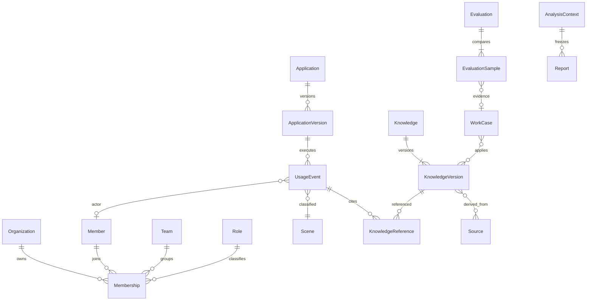

# 数据模型与指标字典 v1

状态：拟实现的标准模型；当前演示对象是其子集。字段类型和读写 Schema 以 [OpenAPI](./openapi.yaml) 为准；下面补充跨字段规则。

## 对象与关系

所有主键是不透明字符串；会话、上下文、报告等由服务端分配，导入内容/事件由接入器在服务端预先分配的来源命名空间内稳定生成。企业外键不可从客户端覆盖。对外不暴露数据库自增 ID、API Key、手机号、openid、session_key、供应商凭证。逻辑实体的联合唯一键至少含 organization_id。来源系统 ID 放在外部映射表，不将名称作为稳定键。导入主键示例为 gw:usage:log_123，跨来源引用先通过受信适配器的映射解析到标准主键；不能为同一源对象每次导入生成新ID。

| 存储对象 | 主键/关联 | 历史与约束 |
| --- | --- | --- |
| Organization | id，外部 organization public_id | 企业停用立即停止读取；不从 sub2api group_id 推断部门 |
| ManagerGrant | user_id + organization_id + capability + team集合 | 授权版本随撤权变化；是新 BI 授权，不是员工登录身份 |
| WeChatBinding | 小程序 AppID + openid → 管理账号 | 服务端保存；一次性绑定挑战与账号确认；解绑撤销全部该绑定会话 |
| Member / Team / Role | id + org_id | 名字可变；离职保留历史匿名/允许的身份标识，不物理改写历史事件 |
| Membership | member_id/team_id/role_id，[valid_from,valid_to) | 每时点一条主部门/主岗位用于可加总视图；辅助归属仅用于筛选且人数去重 |
| Eligibility | member_id + application/scene + 生效区间 | 明确谁可使用；不可用调用单列异常，不暗增采用分母 |
| Application / Version | 应用类型、版本、适用范围 | 版本不可变；企业应用与底层模型分开；适用范围需历史化 |
| UsageEvent | source_id + event_id + revision | 一次实际调用尝试；retry_of 可关联原尝试，重试调用各计用量，重复投递不计两次 |
| InteractionRating | usage_event_id + rater + revision | 首版一个交互采纳一条使用者当前评价；修订替换不叠加；按交互发生期统计 |
| Knowledge / Version | id，version_id | 当前状态与不可变正文/适用范围版本分开；版本带 owner、来源、有效区间 |
| KnowledgeReference | usage_event_id + knowledge_version_id | 同一次调用重复引用同一版本去重；一条知识总引用按 event_id 去重 |
| WorkCase / Source | id，版本/来源引用 | 案例是结构化工作证据，来源是独立 ACL 资源；保留删除/失效状态 |
| Evaluation / Sample | 测试集版本、标准版本、两应用版本、sample_id | 两版均来自相同样本；passed/failed/not_run，汇总从样本计算 |
| Favorite | user_id + org_id + knowledge_id | 唯一、幂等，不改变他人收藏 |
| KnowledgeNote | user_id + org_id + knowledge_id，revision | 个人补充意见；300 字；不冒充交互评分，不自动改变有效状态 |
| AnalysisContext | id + user + org + 授权版本 + data_revision | 有效 30 分钟，固定数据/ACL/内容读取版本；ACL 仍逐次实时校验 |
| Report / Share | report_id + version；share_id | 报告不可变，分享 7 天到期且可撤销；失权后不再返回正文 |
| ImportBatch / Checkpoint | connector_id + batch_id | 同一批同一内容重试同结果；游标只在应用成功后推进 |

## 事件与范围

`occurred_at` 是 UTC RFC3339，`received_at` 是接收时刻，所有日/周/月按 Asia/Shanghai 切分。范围 `[start_date, end_date_exclusive)`；本周截至昨日，周一 start=end，`not_observable`。上周与前周各七天；上月与前月完整自然月，提示天数不同。自定义周期本版不开放。

范围是：已授权企业 ∩ 授权团队 ∩ 所选团队 ∩ 可选应用 ∩ 可选场景。选择不存在/无权 ID 返回统一 404，不静默扩大。当前上下文绑定历史数据版本和内容快照时点；新增授权不改变旧快照，撤销授权立即令旧上下文不可用。

正式版采用人数的母体为“期末可使用人员”，主部门/岗位按期末快照；该母体人员在所选范围历史交互用于激活/稳定。期间已离职或调出人员调用仍计事件归属团队的 Token，但不计该期末母体活跃。接口同时给出 `non_cohort_human_tokens`，因此成员列表 Token 之和可以小于团队 Token；其差额必须由离职/调出母体、自动运行、未知身份解释。跨团队全公司活跃去重，不能相加部门活跃代替公司活跃。事件主部门用于用量归属、期末主部门用于人数归属，界面须标口径。

首次使用留存按首次真实有效交互的团队/岗位形成固定队列，不按当前组织重新分组。后续是否仍活跃在同一应用/场景范围观察；转部门不从历史队列移除，离职仍留在分母（表示停止使用），必要时额外解释。权限不足以观察队列完整结果时返回 null，不把不可见当流失。历史采集起点不等于首次使用日；无法确认首次记录时 `history_incomplete`，不得输出完整首用留存。

## 指标表

数值缺失使用 null 和 `reason`；真实零值使用 0。有测量调用时Token显示已观测之和，并附measured/unmeasured数量；全部未测量返回null，完整且没有调用返回字符串0。未测量调用存在时不输出总量增长结论。Token 在 JSON 中用十进制整数字符串，避免 JS 大数精度损失。人数/次数为安全整数；比例为 0–1 数值；百分点差值在客户端 ×100 展示；不返回已格式化的“6.0M”作为机器字段。

| metric_key | 定义/分母 | 比较与边界 |
| --- | --- | --- |
| eligible_members | 期末可使用人员去重 | 应用/场景适用范围取交集；成员已开通不等于实际可用 |
| activated_members | 上述母体截至期末有成功人员交互 | 历史不完整时未知，而非未激活 |
| active_members | 上述母体本期至少一次成功人员交互 | human 且存在可信身份；失败/自动/unknown 不计 |
| adoption_rate | active / eligible | 分母 0 → null；对比使用各期独立分母 |
| stable_members | 母体在截至期末最近四个完整周中至少三周活跃 | 不是本期 active 子集；历史不足四周为 null |
| repeat_members | 母体本期 ≥2 个不同自然日成功交互 | 不按调用次数；分母为 eligible 的比例另显 |
| frequency | 0天/1天/2–3天/≥4天人数 | 四桶合计等于 eligible；本月也按自然日计，桶名不变 |
| weekly_retention | 固定首次使用队列在后续第 k 周成功人员交互人数 / cohort_size | k=1,2,3；完整观察周才计算；0人与不可见/未完成分开 |
| total_tokens | input_tokens + output_tokens | 包含有可靠用量的失败尝试；缓存是 input 子集 |
| human/automatic/unknown_tokens | 按显式 actor_type 拆分 | 三者合计 total；未知不得默认为自动 |
| active_applications | 本期有成功调用的不同应用数 | 含自动应用；不计 unknown 应用占位 |
| request_count / failed_requests | 终态调用尝试总数 / 失败尝试数 | 不等同任务数；unknown outcome 单列，不纳入失败率分母 |
| failure_rate | failed / (succeeded + failed) | 无已知终态为 null；供应商无用量失败也应保留 |
| rated_interactions | 本期有已采纳评价的人员交互数 | 一交互一票；成功失败都可评，自动执行不进入该分母 |
| helpful_rate / feedback_coverage | good / rated；rated / human_requests | 无评价 → helpful null，0/正数覆盖率为0；小样本显示分子分母 |
| valid_knowledge | 内容快照时点当前可见 valid 的知识数 | 与 period 内事件数不同；过滤 app/scene 与可见范围 |
| reused_valid_knowledge | 上述知识本期被成功调用引用的不同知识数 | 引用只依据实际 version，不用当前依赖配置推算 |
| knowledge_reuse_rate | reused_valid / valid | 新知识观察窗口短；分母0 null |
| knowledge_references | 成功事件中该知识被引用的不同 event_id 数 | 同一事件多版本/多次引用该知识仍计1；不表示解决 |
| stale_referenced_now | 当前已过期知识在周期内仍有引用的不同知识数 | 另给 `expired_at_use`，避免声称历史引用时也过期 |
| added_valid / updated_valid | 当前有效且本期创建 / 当前有效、之前创建且本期有实质版本更新 | 不将浏览/收藏等变化视为实质更新；两集合互斥 |
| evaluation_pass_rate | 同一完整测试集 passed / sample_count | not_run 不按通过，需单列；两版条件不一致不可比 |

同比/环比：率指标返回各期比例和差值；绝对数增长率 previous>0 才可算，previous=0 返回 `no_baseline`。前期范围不足/缺来源返回 `incomplete_data`。本月和上月天数不同仍展示总量但不自动归因。

## Token 归一化与事实边界

核验 sub2api 本地代码：`usage_log_repo_dashboard.go` 存在 `input + output + cache_creation + cache_read` 的总量查询；`openai_gateway_usage.go` 从供应商包含缓存的总输入中扣除缓存后落入互斥桶。不能直接把数据库 `input_tokens` 当成本产品总输入。

| 来源编码 | 标准化 input | 标准化 total |
| --- | --- | --- |
| sub2api 互斥桶 | raw.input + raw.cache_read + raw.cache_creation | 标准 input + raw.output |
| 已包含缓存的供应商总输入 | raw.input | raw.input + raw.output |
| 缺失/无法确认编码 | null，隔离或标记未知 | 不猜测，也不把未知记 0 |

示例：原始 input=100、read=40、write=10、output=20 → 标准 input=150，total=170，缓存不再额外累加。原始 inclusive input=150、read=40、write=10、output=20 → 同样170。5m/1h 缓存写入是 cache_creation 的细分，不能再次相加。图像/视频按次计费而无可靠 Token 时 `token_status=unavailable`，保留调用数；不从费用反推 Token。异常桶大于总输入时隔离，禁止 max(0) 静默掩盖数据错误。

原网关不同统计接口可能存在历史口径差异；集成以明细和归一化版本为依据，与选定接口逐模型对账，不宣称所有现有总量完全等价。

## 数据完整性与存储策略

服务返回 `data_revision`、`metric_version=bi-v1`、`complete_through`、每来源 `status`、缺失维度和原因。缺少 actor/app/scene 映射保留 unknown 桶；缺少请求结果无法算失败率；历史不足无法算首次留存。前端不能因为数组为空就推导“企业没有使用”。

建议默认：事件明细与内容历史 24 个月、报告快照 24 个月、审计 180 天；是待企业数据策略确认的设计值，不是现有配置。来源删除/撤权立即作用于读取和搜索，过期清理走服务端保留策略与审计。仅同步所需结构化事实和已授权来源，不默认复制完整聊天记录。归档报告保留内容版本但不得绕过当前来源权限。

## v1.1 实现边界补充

- 数值未知与实际为0分开：UsageStats调用/评价计数、AssetStats计数、知识usage计数、成员active_days及频率桶允许null。能完整确认的零值才返回0。来源完全不可用时相关计数为null，列表可为空，但必须结合Context.sources判断，不能显示“企业没有数据”。部分覆盖时可返回已观测值，Context标partial、来源说明缺口，禁止输出完整覆盖或增长结论。完全无knowledge:read时组合响应Overview.assets为null；有权限但知识源不可用时返回字段为null的AssetStats。
- 单条Eligibility记录的非null application_id与scene_id为AND条件，null为该维度不限；多条有效记录为OR，最后对成员去重。两者都null表示该成员可使用所有已授权应用/场景。没有匹配有效记录不代表全员可用；来源缺失时采用分母未知，不从实际调用者反推分母。ApplicationRecord.team_ids只作当前关联展示，历史采用分母以Eligibility/Membership有效区间为准。
- 四个频率桶固定0、1、2–3、4及以上；历史不完整无法分桶时members均为null，不把未知成员塞进0天桶。留存返回截至context期末最近12个首次使用周（周一开始）内的非空队列，first_week升序；每队列固定返回offset 1/2/3，尚未结束的观察周为null，起点早于可信历史的队列不伪造首用日期。
- seven_day趋势从range.start_date起每7天分桶，末桶截到end_date_exclusive；active_members为桶内去重人数，average_daily_active为每日去重人数之和除以桶自然日数（完整无调用日计0）。缺日数据不能当0；返回partial或unavailable。部门/岗位比较、Token模型和应用明细的null用量排最后，不参与数值求和。
- 案例直接知识版本和直接来源各最多100个，导入超限拒绝；其他可分页关联只返回前100项并设置relations_truncated。关联ID必须经当前权限过滤，少于100并不能证明原始关联总数少于100。
- KnowledgeVersionRecord.valid_to控制版本有效性，不决定历史正文能否查看；发布时可用且后续过期的版本仍可被历史引用。正文、来源版本映射不可变，结束有效期只能通过高revision生命周期关闭。Source正文按version_id存历史，当前ACL撤权对所有历史版本生效。
